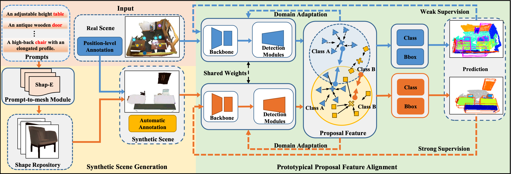

<p align="center">

  <h1 align="center">Prompt3D: Random Prompt Assisted Weakly-Supervised 3D Object Detection</h1>
  <p align="center">
    <strong>Xiaohong Zhang<sup>*</sup></strong>
    ·
    <strong>Huisheng Ye<sup>*</sup></strong>
    ·
    <strong>Jingwen Li</strong>
    ·
    <strong>Qinyu Tang</strong>
    ·
    <strong>Yuanqi Li</strong>
    ·
    <strong>Yanwen Guo<sup>†</sup></strong>
    ·
    <strong>Jie Guo</strong>
  </p>
  <h2 align="center">CVPR 2024</h2>
  <div align="center">
    
  </div>
  <br>
  <p>This repository contains the official implementation for Prompt3D: Random Prompt Assisted Weakly-Supervised 3D Object Detection.</p>
</p>

  ### Thank you for your interest in this repository. We are currently in the process of converting model formats and finalizing scripts. The code will be released at a later time.


## Citation

```bibtex
@inproceedings{zhang2024prompt3d,
  title     = {Prompt3D: Random Prompt Assisted Weakly-Supervised 3D Object Detection},
  author    = {Xiaohong Zhang, Huisheng Ye, Jingwen Li, Qinyu Tang, Yuanqi Li, Yanwen Guo, Jie Guo},
  booktitle = {Proceedings of the IEEE/CVF Conference on Computer Vision and Pattern Recognition (CVPR)},
  year      = {2024},
}
```

<br/>